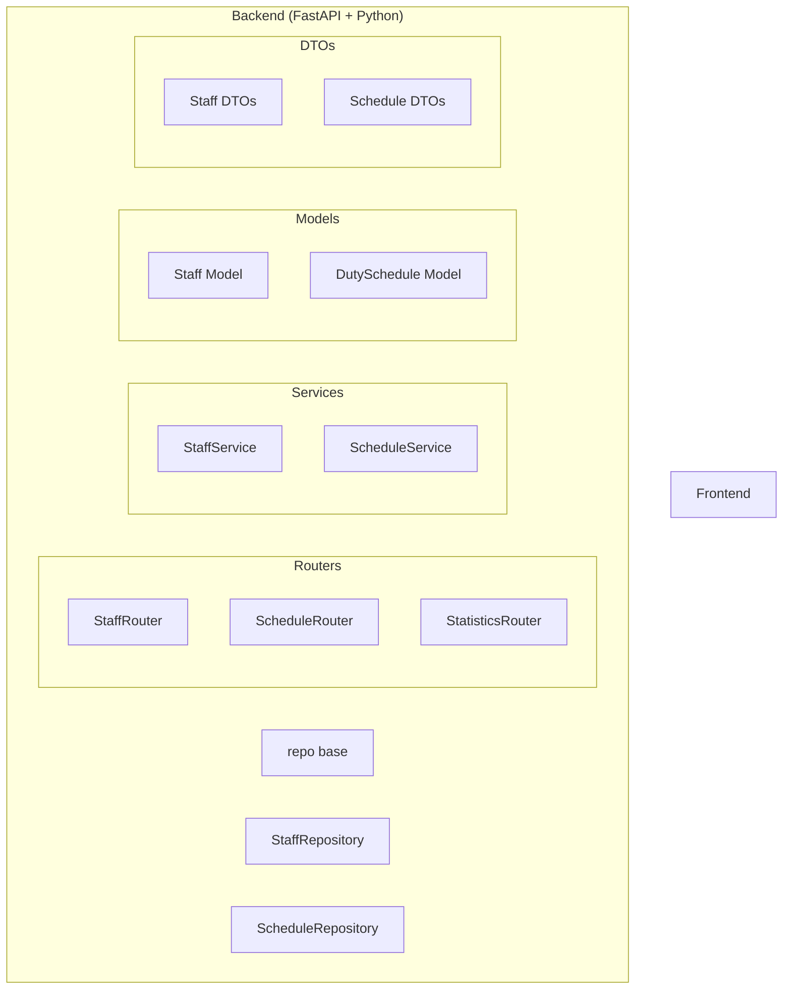

```mermaid
  graph TB
        FE[Frontend]
        
        %% Backend Layer
        subgraph "Backend (FastAPI + Python)"
            subgraph "Routers"
                Route1[StaffRouter]
                Route2[ScheduleRouter]
                Route3[StatisticsRouter]
            end

            subgraph "Services"
                Svc1[StaffService]
                Svc2[ScheduleService]
            end

            Repo[repo base]
                Repo1[StaffRepository]
                Repo2[ScheduleRepository]

            subgraph "Models"
                M1[Staff Model]
                M2[DutySchedule Model]
            end

            subgraph "DTOs"
                SD[Staff DTOs]
                SCD[Schedule DTOs]
            end
        end


```