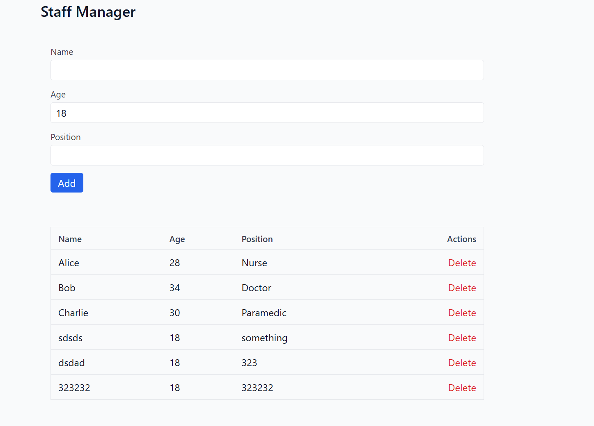
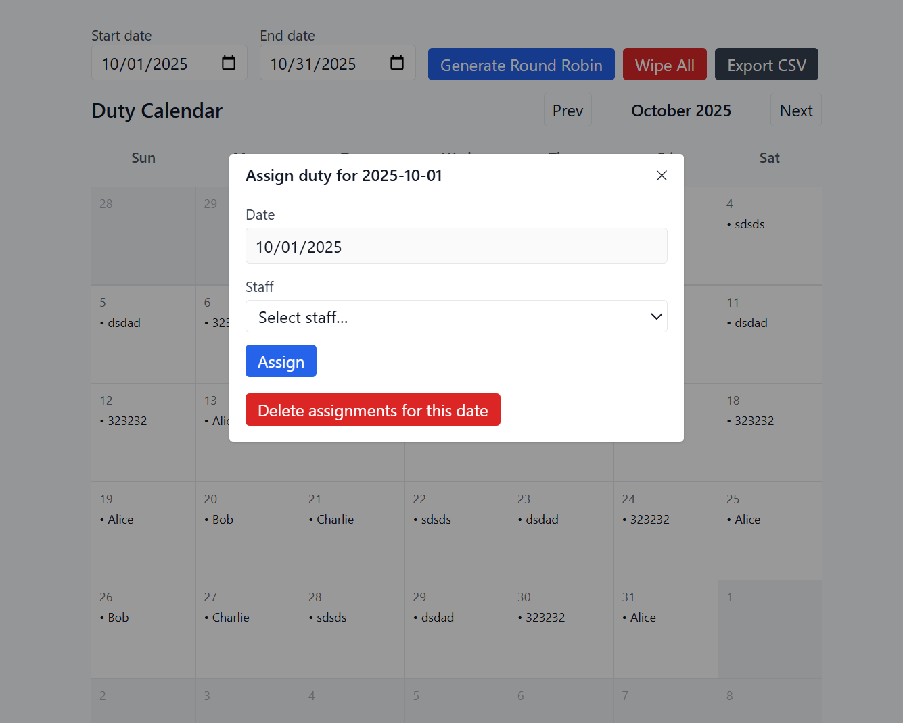
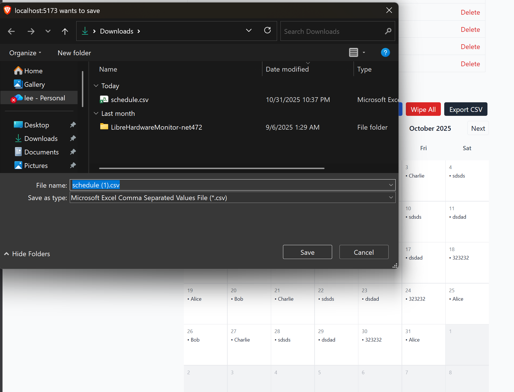
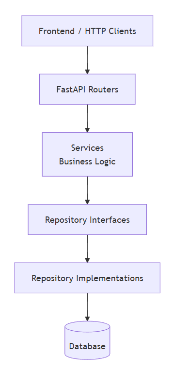

## SETUP
refer to `SETUP.md`

## Features:
Staff Manager to add/delete staffs

Scheduler Calendar
- intelligent scheduling
- clean UI

- picker to upsert staff schedule

- schedule export to csv

## Backend Architecture

## Known Bugs / Issues / Improvements
- no loading modal on frontend to prevent db lock contention operations causing race conditions without user's knowledge
- Setup docker compose orchestration flows